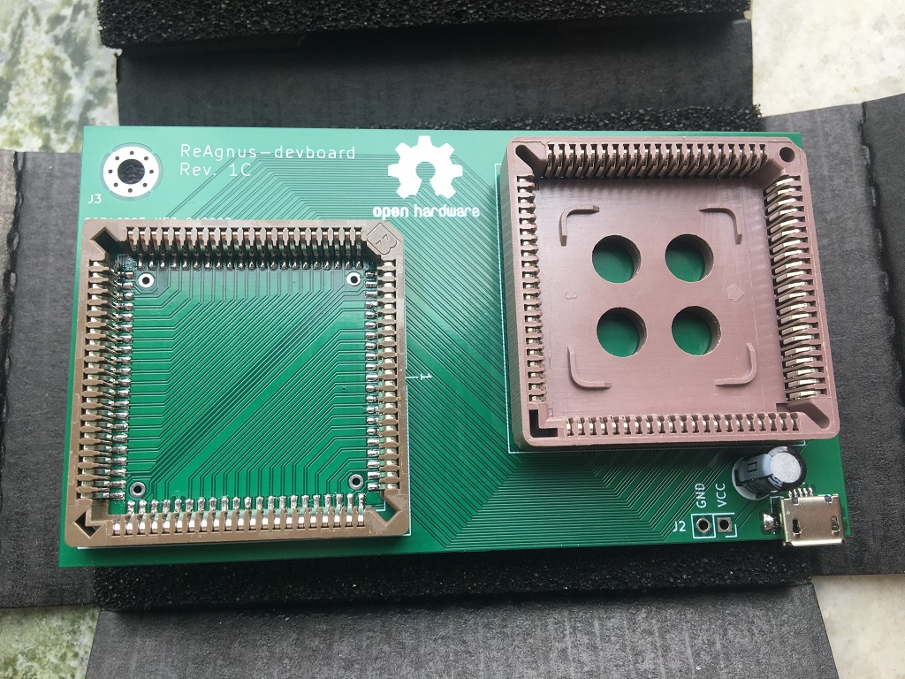
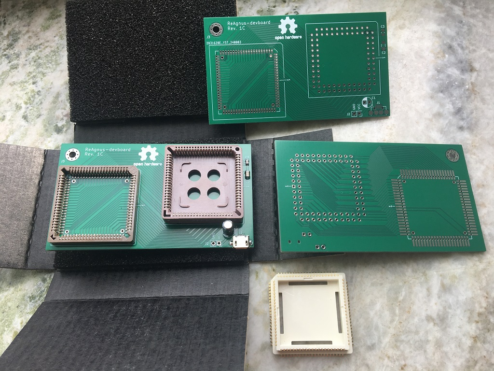
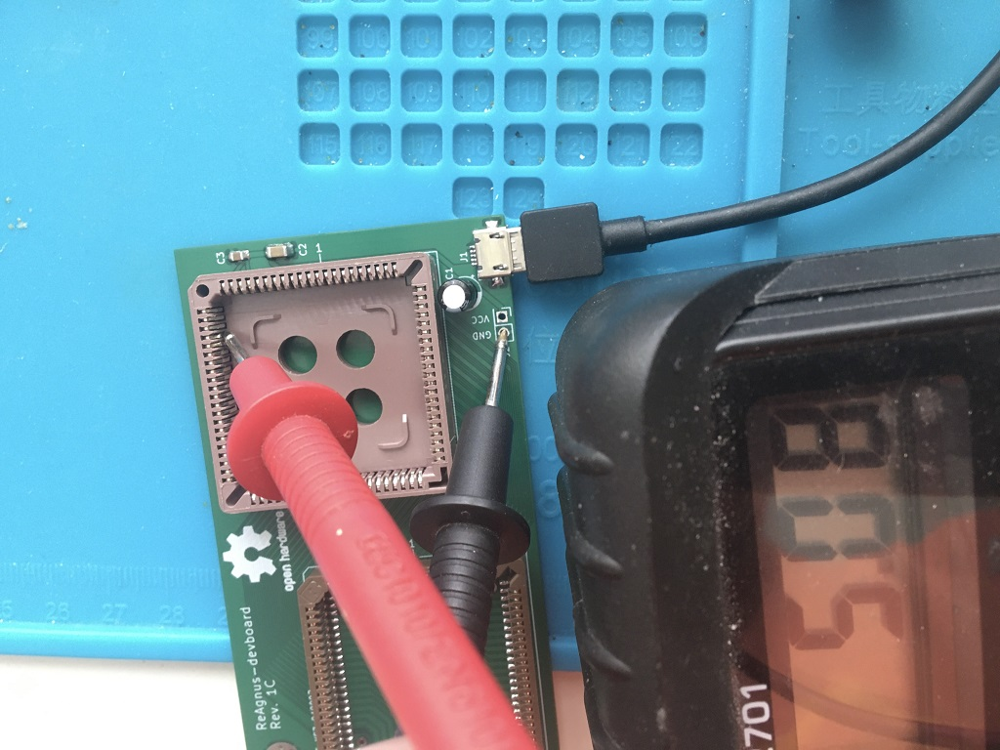
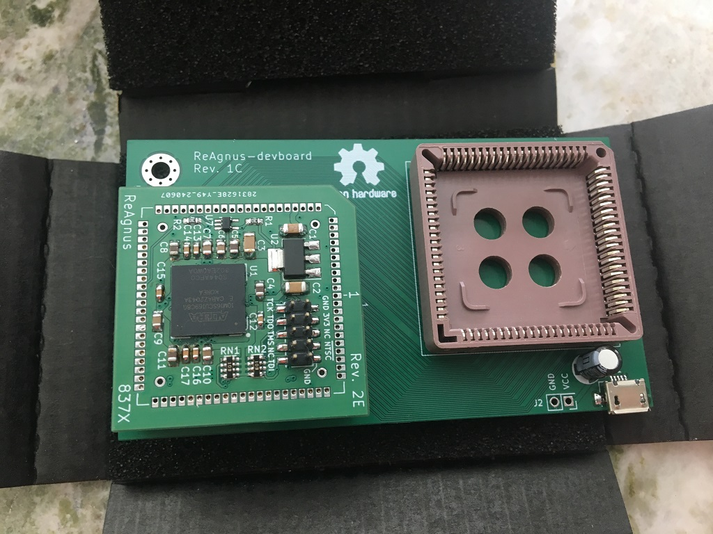
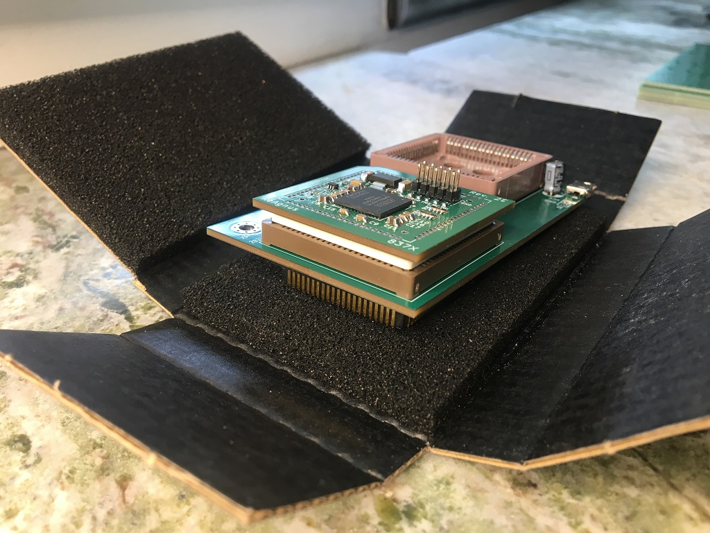

# ReAgnus-devboard
A development board for ReAgnus 

Compatible with the [PLCC-84-plug](https://github.com/jbilander/PLCC-84-plug)

With this board you can signal tap a real Agnus chip by having a real IC in one socket and ReAgnus in the other.

***

REV 1C

 

 

 

 

***

[![CC BY-SA 4.0][cc-by-sa-shield]][cc-by-sa]

This work is licensed under a
[Creative Commons Attribution-ShareAlike 4.0 International License][cc-by-sa].

[![CC BY-SA 4.0][cc-by-sa-image]][cc-by-sa]

[cc-by-sa]: http://creativecommons.org/licenses/by-sa/4.0/
[cc-by-sa-image]: https://licensebuttons.net/l/by-sa/4.0/88x31.png
[cc-by-sa-shield]: https://img.shields.io/badge/License-CC%20BY--SA%204.0-lightgrey.svg
