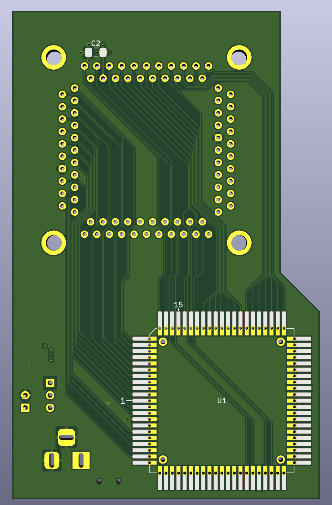

# ReAgnus-devboard
A development board for ReAgnus 8375 designed with footprint for a _Yamaichi_IC51-0844-401-1_Clamshell_THT-Socket_  

Should be compatible with the [PLCC-84-plug](https://github.com/jbilander/PLCC-84-plug) using straight TH-pins from a 2.0 mm pin pitch header.

UNTESTED!!!

***
REV 1B
  

***

[![CC BY-SA 4.0][cc-by-sa-shield]][cc-by-sa]

This work is licensed under a
[Creative Commons Attribution-ShareAlike 4.0 International License][cc-by-sa].

[![CC BY-SA 4.0][cc-by-sa-image]][cc-by-sa]

[cc-by-sa]: http://creativecommons.org/licenses/by-sa/4.0/
[cc-by-sa-image]: https://licensebuttons.net/l/by-sa/4.0/88x31.png
[cc-by-sa-shield]: https://img.shields.io/badge/License-CC%20BY--SA%204.0-lightgrey.svg
